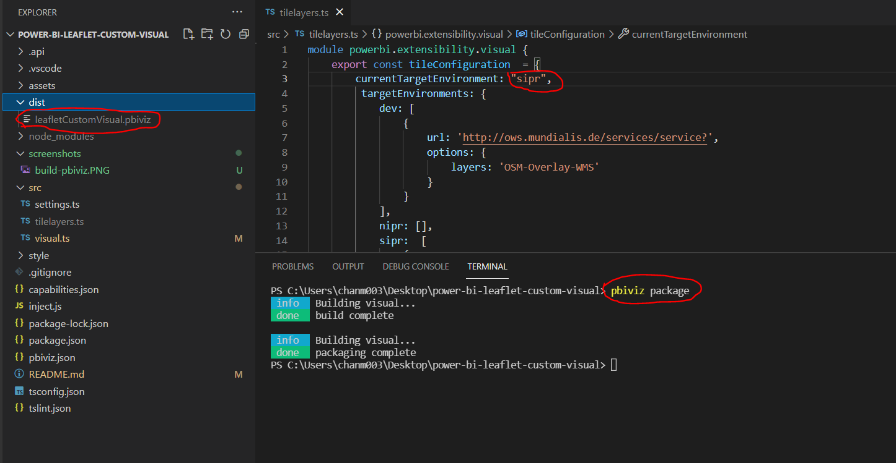

# Power BI Leaflet Custom Visual

This is a demonstration of how [Leaflet](https://leafletjs.com) can be included in a Power BI Custom Visual.

Based off [this repo](https://github.com/avinmathew/power-bi-leaflet-custom-visual) which is compatible with Power BI Desktop May 2020, 2.81.5831.1181

## Pre-requisites for development
1. Sign up for [Power BI](https://app.powerbi.com) account
2. Runtime: [Node.js version manager](https://github.com/coreybutler/nvm-windows/releases) is recommended to run 8.x version
3. Source control: [Git](https://git-scm.com/downloads)
4. Code editor: [Visual Studio Code](https://code.visualstudio.com/download)

## Installing Node.js version manager
1. Run nvm-setup.exe
2. Open command prompt
   ```
   nvm install 8.14.1
   nvm use 8.14.1
   npm install -g powerbi-visuals-tools@2.3.0
   ```
3. Run below commands. When prompted, copy the passhrase, paste the passhrase and browse to "Trusted Root Certification Authorities"
   ```  
   pbiviz --create-cert
   pbiviz --install-cert
   ```

## Create a tilelayers.ts in src directory
This file will not be checked into your source control.  This file should have the following format.
```
module powerbi.extensibility.visual {
    export const tileConfiguration  = {
        currentTargetEnvironment: "dev",
         targetEnvironments: {
            dev: [
                {
                    url: 'http://ows.mundialis.de/services/service?',
                    options: {
                        layers: 'OSM-Overlay-WMS'
                    }
                }
            ],
            nipr: [],
            sipr:  []
        }
    }
}
```

## Download and Start in Development
1. Download from source control
2. ```npm install```
3. Create tilelayers.ts file
4. ```pbiviz start```

## Package for Deployment
1. change `currentTargetEnvironment` setting in `tilelayers.ts`
2. ```pbiviz package```
3. copy .pbiviz file in `dist` folder
